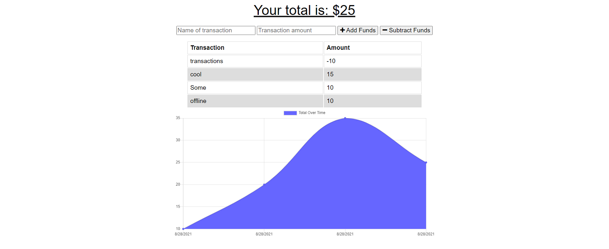

# PWA-FOOSH: Explode Your Budget

## Description

This app is a budget tracker that can also function offline due to Service workers and indexedDb.

https://serene-citadel-84717.herokuapp.com/

## Table of Contents

- [Installation](#installation)
- [Usage](#usage)
- [Credits](#credits)
- [License](#license)

## Installation

To use locally, clone or download the repo, then npm i to get the dependencies. Run a mongodb instance or service to ensure the database will work.

## Usage

To run locally, npm run start to host the website on localhost3001. In the website, you can add transactions that will either increase or decrease your total funds. The total over time is then tracked in a chart below. This app will work even if the internet is disconnected, it will store the records locally until connection is re-established.

## License

MIT License

     Copyright (c) [2021]

     Permission is hereby granted, free of charge, to any person obtaining a copy
     of this software and associated documentation files (the "Software"), to deal
     in the Software without restriction, including without limitation the rights
     to use, copy, modify, merge, publish, distribute, sublicense, and/or sell
     copies of the Software, and to permit persons to whom the Software is
     furnished to do so, subject to the following conditions:

     The above copyright notice and this permission notice shall be included in all
     copies or substantial portions of the Software.

     THE SOFTWARE IS PROVIDED "AS IS", WITHOUT WARRANTY OF ANY KIND, EXPRESS OR
     IMPLIED, INCLUDING BUT NOT LIMITED TO THE WARRANTIES OF MERCHANTABILITY,
     FITNESS FOR A PARTICULAR PURPOSE AND NONINFRINGEMENT. IN NO EVENT SHALL THE
     AUTHORS OR COPYRIGHT HOLDERS BE LIABLE FOR ANY CLAIM, DAMAGES OR OTHER
     LIABILITY, WHETHER IN AN ACTION OF CONTRACT, TORT OR OTHERWISE, ARISING FROM,
     OUT OF OR IN CONNECTION WITH THE SOFTWARE OR THE USE OR OTHER DEALINGS IN THE
     SOFTWARE.

## Badges

## Questions

You can reach me here with any questions:

https://github.com/Joshuawd190

joshuawd190@gmail.com
